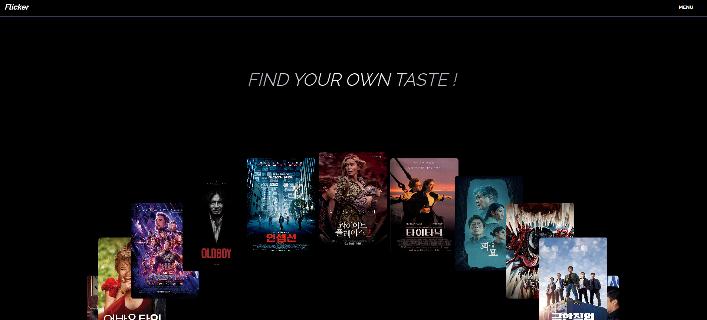
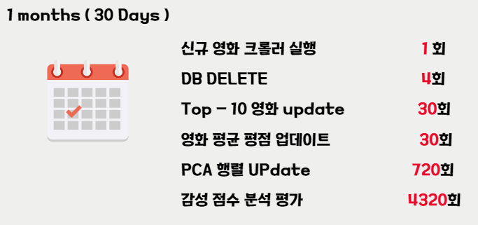
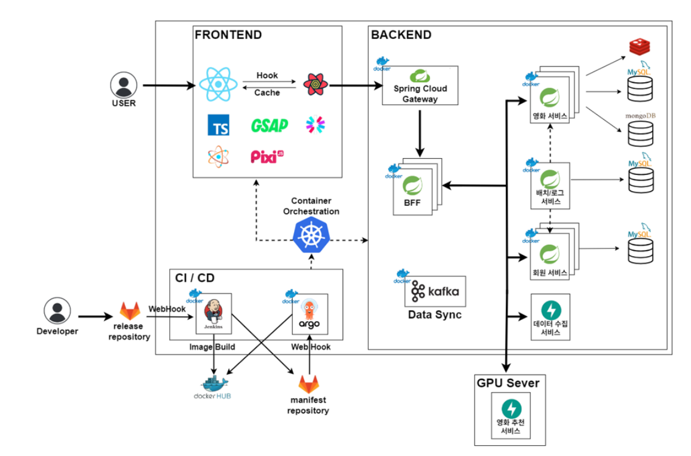

# 🌙 for you , to you , on you Flicker 🌟

> **영화 추천 플랫폼 Flicker**  
> 고객의 시각을 다각화하여 고객 중심의 영화 컨텐츠를 추천

## 

## ✨ 서비스 소개

영화진흥원에 따르면 NetFlix, Watcha등 다양한 영화 플랫폼이 생겨나는 것에 반해, 고객이 직접 영화를 보기 까지 걸리는 시간이 전년도(2023 년 초 기준 현재 2024년 10월)에 비해 4.3일 증가함.

이에 팀 육캔두잇(이하 본팀)은 영화 추천 알고리즘의 고착화와 유저의 시각을 다각화 하였지 못함을 주요 원인으로 파악하고 영화 추천 알고리즘의 구체화, 방식의 다각화를 통해 고객 맞춤형 영화 추천 플랫폼을 계획 하고자 함

---

## ✨ 주요 기능

#### (1) 평점 + 리뷰 기반 추천

평점 리뷰 기반 근접 이웃 도출, 텍스트 마이닝을 통한 초 근접 이웃 유사 군집군 결정

#### (2) 컨텐츠 기반 추천

영화 줄거리, 리뷰, 배우, 감독을 중심으로 word2vec 모델을 학습하여 영화 추천

#### (3) 로그 기반 추천

유저의 행동 로그에 기반하여 영화 추천

#### (4) 리뷰 크롤링 및 DB 반영 자동화

####

**Keep aiming for the stars! 🌠**

---

## ✨ 아키텍처

