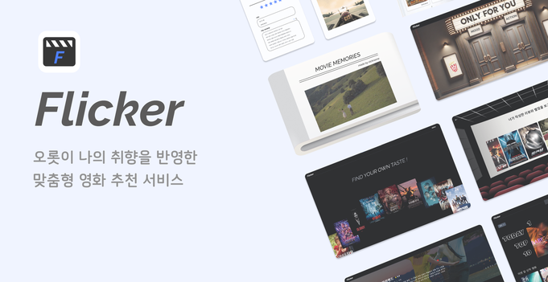
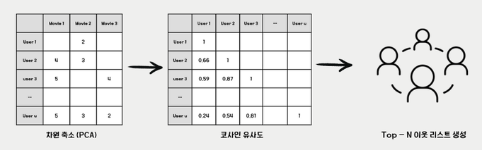
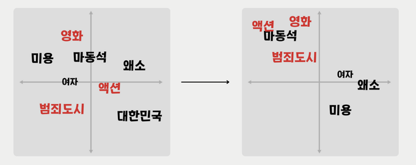
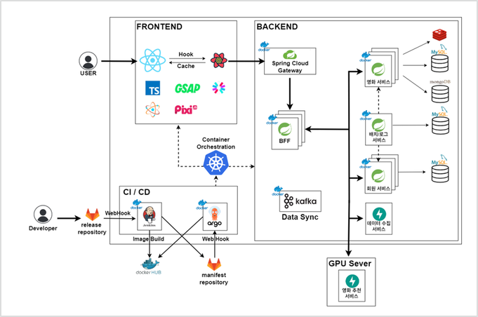

# 🌙 for you , to you , on you Flicker 🌟

> **영화 추천 플랫폼 Flicker**  
> 고객의 시각을 다각화하여 고객 중심의 영화 컨텐츠를 추천

## 

## ✨ 서비스 소개

영화진흥원에 따르면 NetFlix, Watcha등 다양한 영화 플랫폼이 생겨나는 것에 반해, 고객이 직접 영화를 보기 까지 걸리는 시간이 전년도(2023 년 초 기준 현재 2024년 10월)에 비해 4.3일 증가함.

이에 팀 육캔두잇(이하 본팀)은 영화 추천 알고리즘의 고착화와 유저의 시각을 다각화 하였지 못함을 주요 원인으로 파악하고 영화 추천 알고리즘의 구체화, 방식의 다각화를 통해 고객 맞춤형 영화 추천 플랫폼을 계획 하고자 함

---

## ✨ Flicker 페이지 소개

### 1️⃣ HOME

### 2️⃣ MOVIES

### 3️⃣ FOR YOU

### 4️⃣ PHOTOBOOK

## ✨ 주요 기능

#### (1) 평점 + 리뷰 기반 추천

평점 리뷰 기반 근접 이웃 도출, 텍스트 마이닝을 통한 초 근접 이웃 유사 군집군 결정

#### (2) 컨텐츠 기반 추천

영화 줄거리, 리뷰, 배우, 감독을 중심으로 word2vec 모델을 학습하여 영화 추천

#### (3) 로그 기반 추천

유저의 행동 로그에 기반하여 영화 추천

#### (4) 리뷰 크롤링 및 DB 반영 자동화

## ✨ 추천 기능

### **리뷰를 기반으로 한 추천(협업필터링)**

1. 데이터 수집 : 사용자 영화 리뷰 데이터 (평점, 리뷰 등)을 수집하여 협업 핉터링 모델을 구성
2. 차원 축소 : PCA 기법을 사용하여 고차원의 사용자 영화 평점 행렬을 저차원으로 변환
3. 유사도 계산 : 차원 축소된 데이터를 바탕으로 코사인 유사도를 계산하여 비슷한 영화나 사용자를 추천
4. 추천 : 유사도가 높은 영화를 바탕으로 맟춤형 영화 추천 리스트를 생성하여 제공
5. 모델 업데이트 : 실시간 리뷰 로그 데이터를 수집하여 1시간을 주기로 모델 업데이트 진행

### **Word2Vec 모델을 활용한 컨텐츠 기반 추천**

1. 사용자의 행동(ex. 영화 상세조회, 검색 등) 로그를 수집하여 로그 리스트를 기반으로 영화 추천 리스트를 생성
2. 영화 검색 시 DB에서 일치하는 내용을 가지고 오면서 검색 키워드를 기반으로 한 영화 추천 리스트를 생성하여 추가
3. 영화 상세조회 시 해당 영화와 배우를 기반으로 한 추천 리스트를 생성

## 🛠️ 시스템 아키텍처

## ⭐ 팀원 소개

### **_Meet our highly skilled team members!_** |  [팀 노션](https://snowy-lilac-f3b.notion.site/6-5193ecebfd8643ba9d99d29e3bea2482?pvs=4)

|                                     |                                                                                                                                                                   |                                      |                                                                                                                                                                            |
| ----------------------------------- | ----------------------------------------------------------------------------------------------------------------------------------------------------------------- | ------------------------------------ | -------------------------------------------------------------------------------------------------------------------------------------------------------------------------- |
|  | **HaHyul Kim**   Frontend   UX / UI 개발   데이터 캐싱 및 서버 비동기 통신   [GitHub](https://github.com/busangangster)   gkgbf1034@gmail.com      |  | **HyunJeong Cho**   Frontend   UX / UI 디자인 및 개발   JWT 및 서버 비동기 통신   [GitHub](https://github.com/hyunjeongg11)   guswjd4585@gmail.com          |
|       | **JiHwan Gong**   Backend   데이터 수집   영화 도메인 서버   BFF 서버 설계 및 구현  [GitHub](https://github.com/izgnok)   rinch12332@gmail.com  |            | **DongGyu Oh**   Backend   유저/리뷰 도메인 개발   시스템 아키텍처 설계   부하 테스트   [GitHub](https://github.com/Eastplanet)   ehdrb1645@gmail.com    |
|           | **JaeChan Lee**   Infra   인프라 아키텍처, CI/CD 구축   추천 모델 훈련 및 서버 구현   [GitHub](https://github.com/jaechanjj)   jaechanjj@gmail.com |              | **JaeYoung Choi**   Backend   배치 서버 구현 및 ERD 설계   추천 모델 훈련 및 서버 구현   [GitHub](https://github.com/wodyddldl333)   wodyddldl333@naver.com |

## 🌐 개발 설정

[포팅메뉴얼](https://lab.ssafy.com/s11-bigdata-recom-sub1/S11P21E206/-/blob/master/exec/%EB%B0%B0%ED%8F%AC%20%EA%B0%80%EC%9D%B4%EB%93%9C%20%EB%AC%B8%EC%84%9C.pdf?ref_type=heads)을 참고하세요.
